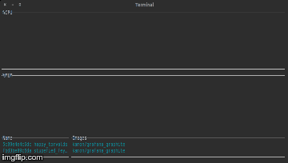

#Dockdash

Realtime docker ps and stats viewer.

Built in go.

Use arrow keys to jump between data and traverse container list.

##Todo
1. Clean up code.
~~2. Calculate cpu use percentage.~~
3. Show memory usage.
~~4. Order stats columns.~~
~~5. Order containers by start time.~~

